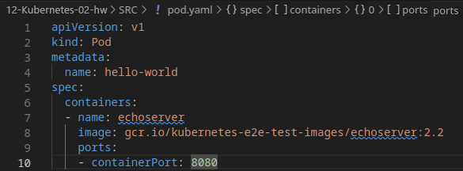
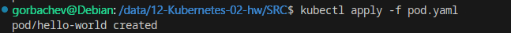
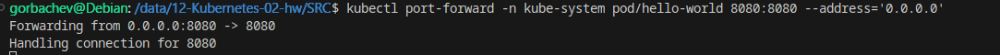
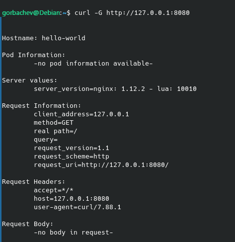
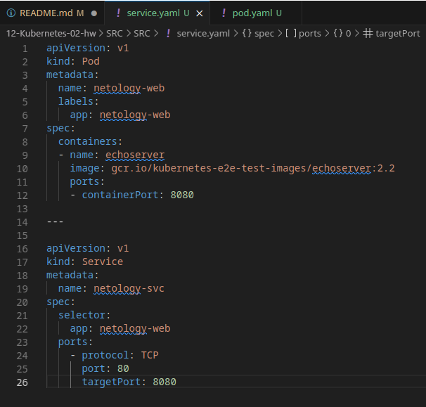
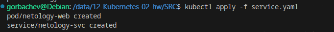
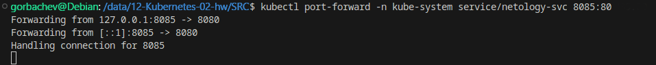
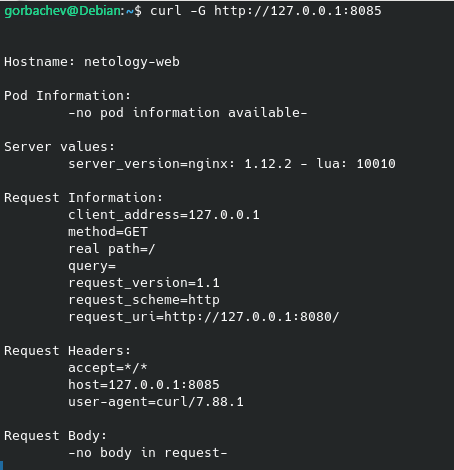

# Домашнее задание к занятию «Базовые объекты K8S» - `Горбачёв Олег`

### Задание 1. Создать Pod с именем hello-world

1. Создать манифест (yaml-конфигурацию) Pod.
2. Использовать image - gcr.io/kubernetes-e2e-test-images/echoserver:2.2.
3. Подключиться локально к Pod с помощью `kubectl port-forward` и вывести значение (curl или в браузере).

------

### Задание 2. Создать Service и подключить его к Pod

1. Создать Pod с именем netology-web.
2. Использовать image — gcr.io/kubernetes-e2e-test-images/echoserver:2.2.
3. Создать Service с именем netology-svc и подключить к netology-web.
4. Подключиться локально к Service с помощью `kubectl port-forward` и вывести значение (curl или в браузере).

------
### Решение задания 1. Создать Pod с именем hello-world

1. Написал манифест для пода.
2. Указал имя пода hello-world, указал образ gcr.io/kubernetes-e2e-test-images/echoserver:2.2:

2. Создал под и запустил его:

3. С помощью port-forward пробрасываю порт пода в локальную сеть, после чего могу подключиться к поду:

С помощью curl смотрю ответ от пода на GET запрос:

### Решение задания 2. Создать Service и подключить его к Pod

1 - 3. Пишу манифест для создания пода и сервиса, связываю их с помощью label и selector, использую образ gcr.io/kubernetes-e2e-test-images/echoserver:2.2:

Запускаю под и сервис:

4. Подключаюсь локально к Service с помощью kubectl port-forward:

С помощью curl смотрю ответ от пода на GET запрос:

При обращении к сервису netolgy-svc по проброшенному порту 8085 вижу ответ от пода netology-web, а значит, связь пода с сервисом работает.

Ссылки на манифесты:

Pod - https://github.com/RikLedger/12-Kubernetes-02/blob/main/SRC%20/pod.yaml

Service - https://github.com/RikLedger/12-Kubernetes-02/blob/main/SRC%20/service.yaml
